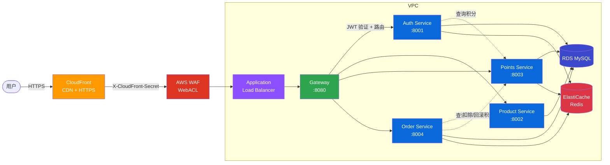
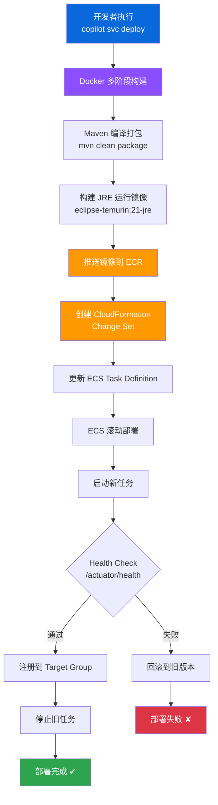
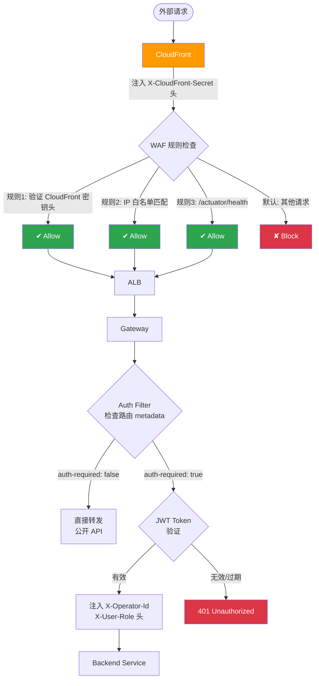
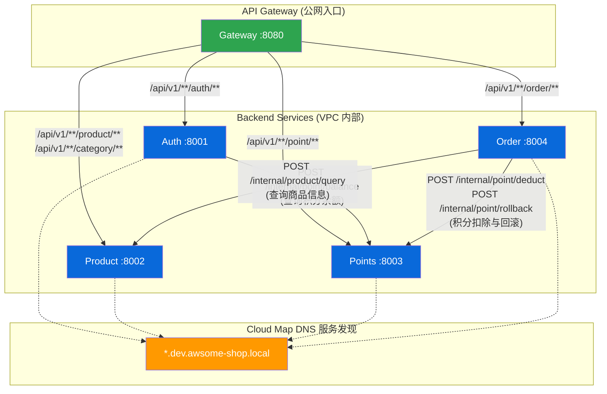
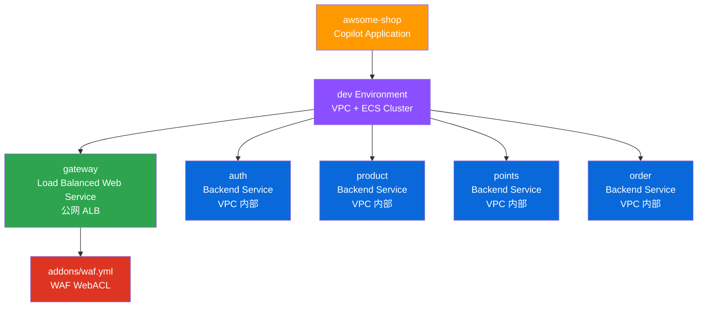
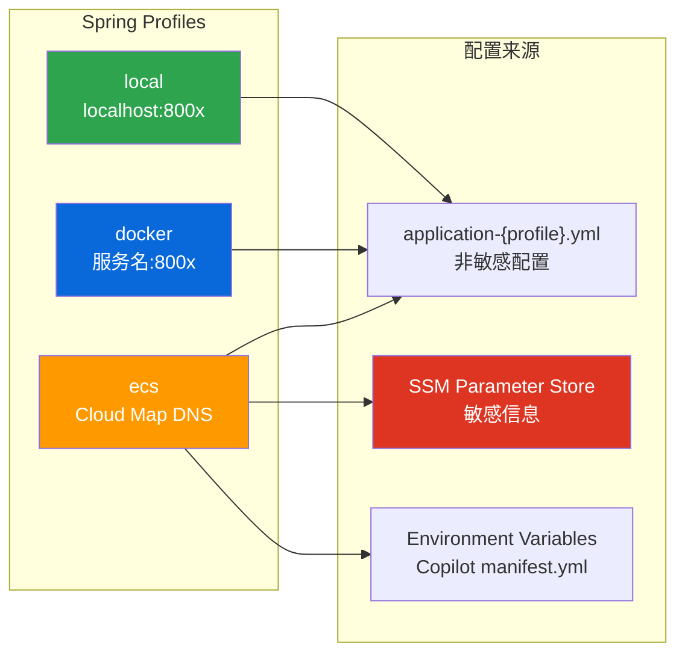

# AWSomeShop 部署方案

## 1. 整体架构



## 2. 部署流程



单个服务部署耗时约 5-8 分钟（构建 + 推送 + 滚动更新）。

## 3. 安全架构



### WAF 规则优先级

| 优先级 | 规则 | 说明 |
|--------|------|------|
| 1 | AllowCloudFront | 验证 `X-CloudFront-Secret` 头 |
| 2 | AllowWhitelistedIPs | IP 白名单放行 |
| 3 | AllowHealthChecks | ALB 健康检查放行 |
| 默认 | Block | 拒绝所有其他请求 |

## 4. 服务间通信



## 5. Copilot 项目结构



```
copilot/
├── .workspace               # 应用名: awsome-shop
├── environments/
│   └── dev/
│       └── manifest.yml     # 环境配置 (VPC, Cluster)
├── gateway/
│   ├── manifest.yml         # Load Balanced Web Service (公网)
│   └── addons/
│       └── waf.yml          # WAF WebACL 规则
├── auth/
│   └── manifest.yml         # Backend Service (VPC 内部)
├── product/
│   └── manifest.yml         # Backend Service
├── points/
│   └── manifest.yml         # Backend Service
└── order/
    └── manifest.yml         # Backend Service
```

## 6. 环境配置管理



| Profile | 用途 | 服务发现方式 |
|---------|------|------------|
| local | 本地开发 | `localhost:800x` |
| docker | Docker Compose | Docker 服务名:800x |
| ecs | ECS Fargate | Cloud Map DNS |

### 敏感信息 (SSM Parameter Store)

```
/copilot/awsome-shop/dev/secrets/jwt-secret
/copilot/awsome-shop/dev/secrets/encryption-key
/copilot/awsome-shop/dev/secrets/db-host
/copilot/awsome-shop/dev/secrets/db-port
/copilot/awsome-shop/dev/secrets/db-username
/copilot/awsome-shop/dev/secrets/db-password
```

## 7. 技术栈

| 组件 | 技术 |
|------|------|
| 容器编排 | AWS ECS Fargate |
| 部署工具 | AWS Copilot CLI（底层 CloudFormation） |
| 服务发现 | AWS Cloud Map（DNS: `*.dev.awsome-shop.local`） |
| CDN & HTTPS | Amazon CloudFront |
| 安全防护 | AWS WAF WebACL |
| 数据库 | Amazon RDS MySQL |
| 缓存 | Amazon ElastiCache Redis |
| 容器仓库 | Amazon ECR |
| 密钥管理 | AWS SSM Parameter Store |
| 实例规格 | 4 vCPU / 8 GB（每服务） |

## 8. 常用运维命令

```bash
# 部署单个服务
copilot svc deploy --name auth --env dev

# 查看服务状态
copilot svc status --name auth --env dev

# 查看实时日志
copilot svc logs --name auth --env dev --follow

# 进入容器调试 (ECS Exec)
copilot svc exec --name auth --env dev

# 部署全部服务 (逐个执行，不可并行)
for svc in auth product points order gateway; do
  copilot svc deploy --name $svc --env dev
done

# 查看应用概览
copilot app show

# 查看环境信息
copilot env show --name dev
```

